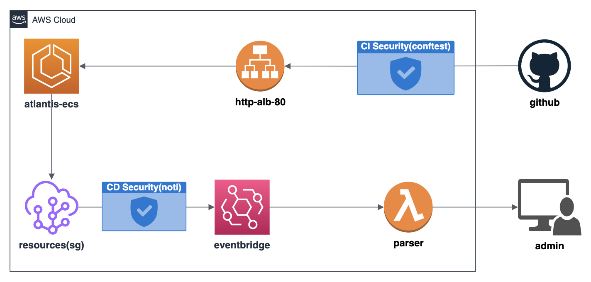

# terraform-cicd-security

- ## Description

  - ### deploy-atlantis
    - Terraform CI/CD Tool
    - Caution : I just modified source code that 'terraform-aws-modules/atlantis/aws' folder because of no domain for using https. Later time maybe uploading modified source code.
    - Sadly, I used my money($12) for https(buying domain BLAH.com). You shouldn't do that. 😂
  - ### deploy-aws
    - AWS EventBridge + Lambda(Terraform)
  - ### modules
    - github-repository-webhook
    - etc...
  - ### test
    - Create AWS SecurityGroup for CI/CD Security test using Terraform

- ## Architecture

  - 
